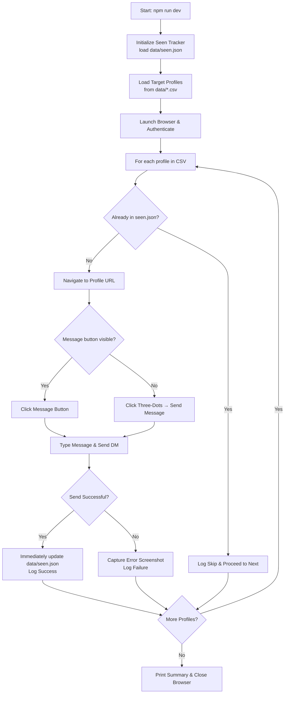

<div align="center">

# 🤖 Instagram Outreach Automation

**A production-ready Instagram DM outreach automation engine**  
Built with **Node.js · TypeScript · Playwright · CSV Data Loading · Real-Time Tracking**

[](https://nodejs.org/)
[](https://www.typescriptlang.org/)
[](https://playwright.dev/)
[](https://opensource.org/licenses/ISC)

---

*Send personalized Instagram direct messages from CSV data with automatic deduplication, real-time `seen.json` checkpointing after every single message, and robust CAPTCHA/2FA handling.*

</div>

---

## ✨ Highlights & Features

| Feature | Description |
|---|---|
| 📄 **CSV Data Loading** | Automatically reads target profiles and customized messages from `data/messages.csv` (or any `.csv` file in `data/`). |
| ⚡ **Instant `seen.json` Updates** | `data/seen.json` is updated and flushed to disk **immediately after every message is sent** — no lost progress if the run is stopped or interrupted. |
| ⏭️ **Automatic Deduplication** | Profiles already present in `data/seen.json` are skipped automatically before opening the browser page. |
| 🔁 **Fallback Messaging** | Automatically detects and clicks the three-dots options menu if the main "Message" button is hidden. |
| 🔐 **2FA / OTP Support** | Detects login challenges and prompts for security codes directly inside the terminal. |
| 🚨 **CAPTCHA Alerts** | Triggers system bell alerts and allows up to 5 minutes for manual verification resolution. |
| 📸 **Error Screenshots** | Captures and saves full-page screenshot snapshots on failures to `screenshots/` for quick debugging. |
| 🔗 **Smart URL & Username Parsing** | Normalizes URLs (e.g., adding `https://` / slashes) and infers usernames from URLs if omitted. |

---

## 🗺️ Workflow Architecture



---

## 📂 Project Structure

```text
src/
├── config/
│   ├── env.ts              # Environment configuration loader
│   └── constants.ts        # Delays, timeouts, and constants
│
├── auth/
│   ├── login.ts            # Multi-scenario login, OTP & CAPTCHA handler
│   ├── session.ts          # Session detection via cookies & DOM elements
│   └── auth.types.ts       # TypeScript auth interfaces
│
├── instagram/
│   ├── browser.ts          # Persistent Playwright browser setup
│   ├── profile.ts          # Profile navigation & URL normalization
│   ├── messaging.ts        # DM composer with fallback strategies
│   ├── selectors.ts        # Centralized Instagram DOM selectors
│   └── instagram.types.ts  # Instagram TypeScript interfaces
│
├── automation/
│   ├── orchestrator.ts     # Main outreach loop & real-time execution
│   ├── workflow.ts         # Profile → Composer → Send combined workflow
│   ├── tracker.ts          # Real-time seen.json persistence & deduplication
│   └── retry.ts            # Retry utilities
│
├── input/
│   ├── cli.ts              # CLI credential resolver (.env vs prompt)
│   ├── prompts.ts          # Inquirer prompt configurations
│   └── csv.ts              # RFC 4180 compliant CSV parser
│
├── logging/
│   ├── logger.ts           # Structured logging to logs/automation.log
│   └── screenshots.ts      # Error screenshot capture to screenshots/
│
└── index.ts                # Application entrypoint
```

---

## 🛠️ Setup & Installation

### Prerequisites

- **Node.js** v18 or higher
- **Chromium** (installed automatically via Playwright)

---

### Step 1 — Clone & Install

```bash
git clone https://github.com/learnthusalearner/InstaGram-Outreach-Automation.git
cd InstaGram-Outreach-Automation
npm install
npx playwright install chromium
```

---

### Step 2 — Configure Environment (`.env`)

Copy the example configuration file:

```bash
cp .env.example .env
```

Edit `.env` with your Instagram credentials:

```env
INSTAGRAM_USERNAME=your_instagram_username
INSTAGRAM_PASSWORD=your_instagram_password
HEADLESS=false
```

> [!TIP]
> Keeping `HEADLESS=false` is recommended so you can view browser actions and manually resolve any 2FA/OTP prompts or CAPTCHA challenges when required.

---

### Step 3 — Add Target Profiles in `data/messages.csv`

Create or edit `data/messages.csv` with standard CSV columns:

```csv
username,url,message
creator1,https://www.instagram.com/example_user1/,"Hi there! We would love to collaborate with you."
creator2,https://www.instagram.com/example_user2/,"Hey! Loved your recent content and wanted to connect."
```

> [!NOTE]
> - The parser is fully **RFC 4180 compliant**: you can include commas, quotes (`""`), and multiline strings inside double quotes.
> - The `username` column is optional — if empty, the handle will be extracted automatically from the URL.

---

### Step 4 — Run the Automation

Start the outreach automation:

```bash
npm run dev
```

The script will:
1. Load `data/seen.json` to identify previously messaged profiles.
2. Read your target list from `data/*.csv`.
3. Check Instagram session and log in if needed.
4. Skip profiles that are already in `data/seen.json`.
5. Send DMs one-by-one, **updating `data/seen.json` immediately after each successful message**.
6. Print a final summary when complete.

---

## 📊 Deduplication & Real-Time Tracking (`seen.json`)

All sent messages are saved to `data/seen.json` in real time:

```json
[
  {
    "username": "creator1",
    "url": "https://www.instagram.com/example_user1/",
    "message": "Hi there! We would love to collaborate with you.",
    "status": "SENT",
    "timestamp": "2026-08-27T06:45:00.000Z"
  }
]
```

- If the script stops, crashes, or is closed mid-run, `data/seen.json` is already saved up to the last sent message.
- Re-running the script will automatically skip all accounts recorded in `seen.json`.

---

## 📋 Logging & Debugging

| Output | Location | Description |
|---|---|---|
| Seen History | `data/seen.json` | JSON tracker updated immediately on every send |
| Execution Log | `logs/automation.log` | Timestamps, status, username, URL, and errors |
| Error Screenshots | `screenshots/error-<profile>-<timestamp>.png` | Full-page snapshots captured on failures |

---

## ⚠️ Edge Cases Handled

| Scenario | Solution |
|---|---|
| **Hidden Message button** | Automatically falls back to clicking three-dots options → "Send message". |
| **Instagram 2FA / OTP** | Detects verification screens and prompts for the code in your terminal. |
| **CAPTCHA / Security check** | Rings system alert beeps and allows up to 5 minutes for manual browser completion. |
| **Cookie banners & popups** | Automatically dismissed before navigating and interacting. |
| **Interrupted / Cancelled runs** | `seen.json` is updated after each individual message so no progress is ever lost. |
| **Malformed URLs** | Automatically normalizes missing `https://` protocols and slashes. |

---

## ⚖️ Disclaimer

> [!WARNING]
> This tool interacts with Instagram through browser automation. Use it responsibly and in accordance with [Instagram's Terms of Service](https://help.instagram.com/581066165581870). Excessive or rapid messaging may trigger account rate limits or temporary restrictions.
