# Instagram Outreach Automation (Modular Node.js + TypeScript + Playwright)

A production-ready, highly resilient, and modular Instagram automation script built to handle bulk direct message outreach. Using a single persistent Playwright browser instance, this script handles session reuse, CLI-based login, terminal OTP prompts, manual CAPTCHA solving alert sounds, profile options menu fallbacks, and account deduplication.

---

## 📊 Complete Automation Flow Diagram

The following Mermaid diagram illustrates the lifecycle of the automation, including credentials resolution, dynamic session state checking, and manual verification bypass with system beeps:

```mermaid
graph TD
    A[Start] --> B[Read Credentials from .env]
    B --> C{Credentials found in .env?}
    C -- No --> D[Prompt username/password via CLI]
    C -- Yes --> E[Launch persistent browser instance]
    D --> E
    E --> F[Navigate to instagram.com]
    F --> G{Is session already authenticated?}
    
    G -- Yes --> H[Read data/messages.txt]
    G -- No --> I{Is 'Continue' button visible?}
    
    I -- Yes --> J[Click Continue button]
    I -- No --> K[Click Log In Link]
    J --> L[Wait for password input field]
    K --> L
    L --> M[Enter password and submit]
    M --> N{Is login challenge / OTP / CAPTCHA triggered?}
    
    N -- Yes --> O{Is it an OTP/2FA code input?}
    O -- Yes --> P[Prompt for OTP code in terminal]
    P --> Q[Fill OTP in browser & click Confirm]
    O -- No --> R[Display CAPTCHA alert in terminal]
    R --> S[Trigger repeated system alert beeps]
    S --> T[Wait up to 5 mins for manual solver]
    Q --> U[Check log in success]
    T --> U
    
    N -- No --> U
    U --> H
    
    H --> V[Load first/next profile record]
    V --> W{Is creator username already processed?}
    W -- Yes --> X[Skip creator and proceed]
    W -- No --> Y[Navigate directly to profile URL]
    
    Y --> Z{Is standard Message button visible?}
    Z -- Yes --> AA[Click Message button]
    Z -- No --> AB[Click three-dots button next to profile name]
    AB --> AC[Click Send Message option from options popup]
    AA --> AD[Wait for DM Composer to load]
    AC --> AD
    
    AD --> AE{Is message input field visible?}
    AE -- No --> AF[Focus Conversation container to activate input]
    AF --> AG[Fill message and click Send]
    AE -- Yes --> AG
    
    AG --> AH[Close DM panel]
    AH --> AI[Mark SUCCESS in processed_profiles.json]
    AI --> AJ{More profiles in file?}
    
    Y -- Action Failed --> AK[Log error details & screenshot failed page]
    AK --> AL[Mark FAILED in processed_profiles.json]
    AL --> AJ
    
    AJ -- Yes --> V
    AJ -- No --> AM[Print batch summary & Close Browser]
    X --> AJ
    AM --> AN[End]
```



---

## 🌟 Solved Edge Cases & Key Features

During production development, the automation has been hardened against the following common Instagram automation blockers and UI variations:

### 1. 🔐 Saved Account / "Continue" UI Variation
Instagram often remembers the last profile and presents a **"Continue as \<username>"** button instead of the username/password fields.
- **Solution**: The script polls for both credentials inputs and "Continue" buttons. If a "Continue" button is detected, it clicks it, waits for the password input screen, and then logs in automatically.

### 2. 🍪 Cookie banners & Overlay Blocks
Global or regional network connections frequently cause Instagram to load cookie consent dialogs that block interaction with inputs.
- **Solution**: The script automatically detects and clicks cookie dismissal selectors (e.g. `Allow all cookies`, `Decline optional cookies`, `Accept`) before trying to interact with the page.

### 3. 📲 Terminal OTP / 2FA Interactivity
When Instagram triggers a Two-Factor Authentication (2FA) checkpoint:
- **Solution**: The automation pauses and prompts you directly in the terminal CLI: `Enter the Instagram OTP / Security Code sent to your device:`. Once entered, it automatically fills the OTP into the browser's verification input and submits it.

### 4. 🚨 CAPTCHA & Security Check Sound Alarm
If Instagram prompts a visual CAPTCHA or checkpoint page that requires manual sliding/selection:
- **Solution**: The terminal prints a highly visible warning banner and triggers an **audio system bell beep (`\x07`)** to alert you. It rings 5 times immediately and continues to ring 3 times every 8 seconds for up to 5 minutes, allowing you to solve it manually in the opened browser window before resuming.

### 5. 💬 Profile Options (Three-Dots) Message Fallback
For profiles where a standard "Message" button is hidden or missing (such as private, business, or un-followed accounts):
- **Solution**: The script checks if the direct "Message" button is visible. If it is absent, it locates the options button (three dots `...` next to the profile name), clicks it, and selects **"Send message"** from the popup menu.

### 6. 🚫 Sidebar False Positives Exclusion
Instagram's global navigation sidebar includes a direct message icon which has a selector footprint matching `[aria-label="Message"]`.
- **Solution**: Restricts profile Message buttons strictly to `main` and `header` sections to prevent false clicks that would otherwise redirect the browser to the general inbox instead of opening the creator's DM composer.

### 7. ⏭️ Persistent Account Deduplication
To protect your reputation and avoid double-texting accounts across restarts:
- **Solution**: Maintained inside [`data/processed_profiles.json`](data/processed_profiles.json). The script indexes every outreach by lowercase creator username. Before opening any profile, it checks the tracker; if the creator has already been messaged, it skips the profile immediately and proceeds to the next creator.

---

## 📂 Directory Architecture

```text
src/
├── config/
│   ├── env.ts          # Dotenv configuration loading
│   └── constants.ts    # Centralized delays and configs
│
├── auth/
│   ├── login.ts        # Dynamic multi-path login & OTP handler
│   ├── session.ts      # Active session check using cookies & DOM elements
│   └── auth.types.ts   # Authentication TypeScript type interfaces
│
├── instagram/
│   ├── browser.ts      # Single persistent Playwright browser creation
│   ├── profile.ts      # Profile navigation & cookie popups dismissal
│   ├── messaging.ts    # DM composer fallback & focus handler
│   ├── selectors.ts    # Centralized, robust Instagram DOM selectors
│   └── instagram.types.ts
│
├── automation/
│   ├── orchestrator.ts # Browser lifecycle, loop sequential processing, and stats
│   ├── workflow.ts     # Combined page navigation -> message composers -> DMs
│   └── tracker.ts      # Processed profiles persistent JSON deduplication
│
├── input/
│   ├── cli.ts          # Resolves CLI prompts & environment defaults
│   ├── prompts.ts      # Inquirer CLI username / password prompt settings
│   └── txt.ts          # Hyphen-safe messages.txt parser
│
├── logging/
│   ├── logger.ts       # Structured logging to logs/automation.log
│   └── screenshots.ts  # Captures screenshots to screenshots/ on failure
│
└── index.ts            # Entrypoint file
```

---

## 🛠️ Getting Started

### 1. Installation

Clone the repository, navigate into the folder, and install the dependencies:

```bash
cd instagram-automation
npm install
```

### 2. Configure Environment (`.env`)

Create a `.env` file in the `instagram-automation` root directory:

```env
INSTAGRAM_USERNAME=your_username
INSTAGRAM_PASSWORD=your_password
HEADLESS=false
```
*Note: Keeping `HEADLESS=false` is recommended so you can view manual OTP verification and CAPTCHA solving screens.*

### 3. Setup Target Messages (`data/messages.txt`)

Create or update `data/messages.txt` following this format:
```text
username profile_url - message_to_send
```
**Example:**
```text
creator1 https://www.instagram.com/vinod_.kumar1230/ - Hi Vinod, I'd love to share something with you.
creator2 https://www.instagram.com/kunalsrivastava658/ - Hey Kunal! I wanted to connect with you.
```
> 💡 *Note: The first occurrence of ` - ` (space-hyphen-space) is used as the split separator, so you can safely use hyphens inside your personalized message body.*

### 4. Running the Script

Start the sequential batch automation:

```bash
npm run dev
```

---

## 📊 Logging & Reports

- **Detailed log history**: All attempts, successes, and errors are appended to:
  ```text
  logs/automation.log
  ```
- **Error Screenshots**: If any profile action fails, the script captures the page state and saves it under:
  ```text
  screenshots/error-<username>-<timestamp>.png
  ```
- **Processed Log (Deduplication)**: Keeps track of all successfully processed accounts in:
  ```text
  data/processed_profiles.json
  ```
